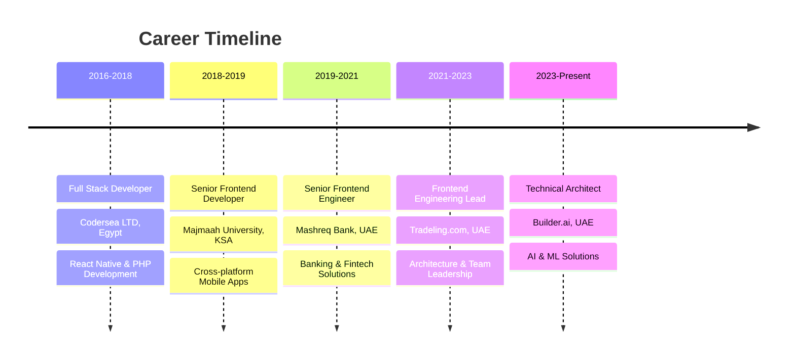

# Hi there! 👋 I'm Abdelrahman Bakry

  
  
  
  
  
  
  

## 🚀 About Me

Experienced **Software Architect** and **Engineering Leader** with **9+ years** in full-stack development, cloud infrastructure, and AI/ML systems. Currently serving as **Technical Architect** at Builder.ai, where I design and deploy AI-driven solutions that integrate Generative AI and LLMs into real-time business applications.

🌟 **UAE Golden Visa Holder** (2022–2032)  
📍 **Location:** Dubai Sports City, UAE  
🎓 **Education:** B.Sc. in Computer Science  
🌐 **Languages:** English & Arabic

---

## 🏢 Professional Journey

---

## 💼 Current Role Highlights

**Technical Architect – AI & ML Solutions** @ Builder.ai *(Feb 2023 - Present)*

🤖 **AI & Machine Learning:**
- Designed and deployed AI-driven web/mobile apps using React, React Native, and Ruby on Rails
- Integrated LLMs and RAG models with semantic search frameworks (Pinecone, Faiss)
- Led optimization of vector search relevancy and indexing strategies using LangChain
- Benchmarked and fine-tuned ML models (TensorFlow/PyTorch) with TPU/GPU acceleration

👥 **Leadership & Communication:**
- Presented AI solutions to clients and internal teams in English and Arabic
- Mentored engineers on AI architecture and ML best practices

---

## 🛠️ Tech Stack & Skills

### 🎨 Frontend Technologies

### ⚙️ Backend & APIs

### 🤖 AI & Machine Learning

**Specialized in:**
- 🧠 **Large Language Models (LLMs)**
- 🔗 **LangChain & RAG Models**
- 🔍 **Semantic Search & Vector Databases**
- 📊 **ML Pipelines & Model Optimization**
- 🎯 **Generative AI Applications**

### ☁️ Cloud & DevOps

### 🗄️ Databases

---

## 🏆 Key Achievements

🎯 <strong>Performance & Innovation</strong>

- ⚡ **Improved app stability** by reducing crash rates by **25%** at Tradeling.com
- 🚀 **Built 60% faster onboarding** tool for corporate clients at Mashreq Bank
- 📱 **Launched MENA's first** smartwatch banking app using SwiftUI + React Native
- 📈 **Delivered 15+ React/React Native** app journeys for retail and corporate banking

🔬 <strong>AI & ML Projects</strong>

- 🤖 **Integrated advanced LLM models** with real-time business applications
- 🔍 **Optimized vector search systems** for improved relevancy and performance
- 📊 **Benchmarked ML models** using TPU/GPU acceleration for production deployment
- 🎯 **Implemented RAG architectures** with semantic search capabilities

👨‍💼 <strong>Leadership & Mentorship</strong>

- 🏗️ **Led frontend architecture restructuring** using modular, feature-oriented design
- 📚 **Created reusable component libraries** and implemented CI/CD pipelines
- 👥 **Mentored engineering teams** on AI architecture and ML best practices
- 🌍 **Presented solutions to international clients** in English and Arabic

---

## 📊 GitHub Analytics

  
  

  

---

## 🎯 What I'm Working On

- 🔬 **AI-Driven Applications:** Building next-generation AI solutions that integrate seamlessly with business workflows
- 🧠 **LLM Optimization:** Fine-tuning large language models for specific business use cases
- 📱 **Cross-Platform Innovation:** Developing mobile-first AI applications using React Native
- ☁️ **Cloud Architecture:** Designing scalable cloud infrastructure for AI/ML workloads

---

## 📬 Let's Connect!

I'm always interested in discussing:
- 🤖 **AI/ML Architecture** and implementation strategies
- 📱 **Mobile & Web Development** best practices
- ☁️ **Cloud Infrastructure** design and optimization
- 👥 **Technical Leadership** and team building

  
  
  
  

  ---
  
  
  
  ⭐ **"Building the future, one algorithm at a time"** ⭐

